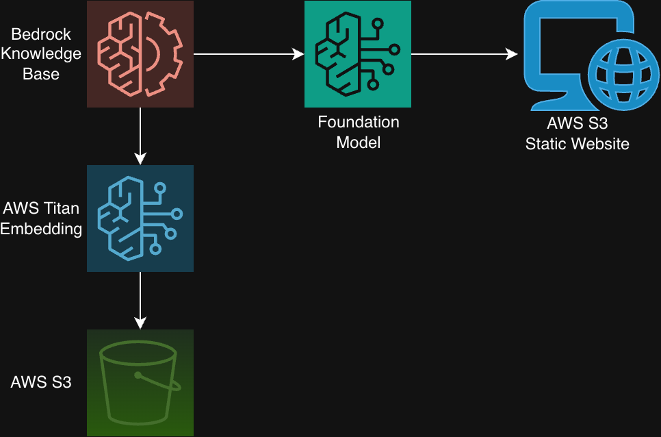

# End to End RAG Implementation Using AWS Bedrock
- This project focuses on implementing a Retrieval Augmented Generation solution on foundation models in AWS using Amazon Bedrock Knowledge Bases.

## Retrieval Augmented Generation (RAG)
RAG is a technique that enhances foundation models by connecting it to external knowledge sources without retraining LLM models nor exposing internal data to third party sources that own the foundation models.
- Instead of relying on the static data from the model's training or retraining the models completely, RAG allows the model to:
    1. **Retrieve** relevant information from internally manageed knowledge bases that may need to remand private.
    2. **Generate** a grounded, accurate response based on the internal knowledge base provided.

## Using Amazon Bedrock Knoweldge Bases
- When implementing RAG using Amazon Bedrock a common step when using foundation models is enabling model access for the ones needed to be used. 
- An important update in AWS that came up when working on **Model Access** is that it is **no longer require** to enabled model access of models in Amazon Bedrock since they are already enabled by default. 
- Another detail that is very important when using Models in Amazon Bedrock are the **Service Quotas** that are **limited** when trying to invoke the model when syncing the knowledge base for RAG integration.
- When working under the Free Tier on the AWS Console it became apparent that no matter how the integration of RAG was developed that the same error keep appearing and this was becasue of the Service Quota limit that was limited for invoking any Foundational Model.
- To invoke the Foundation Model in order to sync the data for the Knowledge Base I had to request an increase of the Service Quota for the Amazon Titan Model Embeddings so that the necessary vectors can be created an stored for a proper integration of RAG for FAQ chatbots.

## Diagram of the Integration of RAG with Amazon Bedrock and S3
